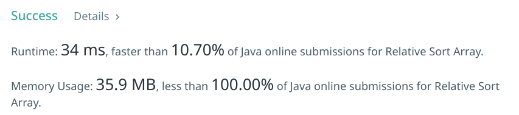

# 1122. Relative Sort Array

## Description

Given two arrays ``arr1`` and ``arr2``, the elements of ``arr2`` are distinct, and all elements in ``arr2`` are also in ``arr1``.

Sort the elements of ``arr1`` such that the relative ordering of items in ``arr1`` are the same as in ``arr2``.  Elements that don't appear in ``arr2`` should be placed at the end of ``arr1`` in ascending order


**Example 1:**

```txt
Input: arr1 = [2,3,1,3,2,4,6,7,9,2,19], arr2 = [2,1,4,3,9,6]
Output: [2,2,2,1,4,3,3,9,6,7,19]
```
 
**Note**

**Links**

[(en)https://leetcode.com/problems/relative-sort-array/](https://leetcode.com/problems/relative-sort-array/)
<br />
[(中文)https://leetcode-cn.com/problems/relative-sort-array/](https://leetcode-cn.com/problems/relative-sort-array/)

## Solutions

### Solution1

使用一个 Map 统计 ``arr2`` 出现的次数，然后遍历 ``arr1``，进行统计，把剩余的元素使用一个 List 进行存放并进行排序（Collections.sort）。

最后将这两部分进行整合即可。

#### Java Code 

```java
class Solution {
    /**
    approach one:
    Complexity Analysis: 
        Time complexity: O(n log n)
        Spacce complexity: O(n)
    */
    public int[] relativeSortArray(int[] arr1, int[] arr2) {
        Map<Integer, Integer> map = new HashMap<>();
        List<Integer> list = new ArrayList<>();
        
        // put elemts into the map for counting
        for (int n : arr2) {
            map.put(n , 0);
        }
        for (int n : arr1) {
            if (map.containsKey(n)) {
                map.put(n, map.get(n) + 1);
            } else {
                list.add(n);
            }
        }
        int[] result = new int[arr1.length];
        int index = 0;
        // combine them together
        for (int n : arr2) {
            for (int i = 0; i < map.get(n); i++) {
                result[index++] = n;
            }
        }
        // sort the rest of elements. using mergeSort built-in in Collections tool.
        Collections.sort(list, (o1, o2) -> o1.compareTo(o2));
        for (int n : list) {
            result[index++] = n;
        }
        return result;
    }
}
```
#### Submission status



可以看到这一解决方式在速度方面是非常不好的，虽然可以解决问题。


