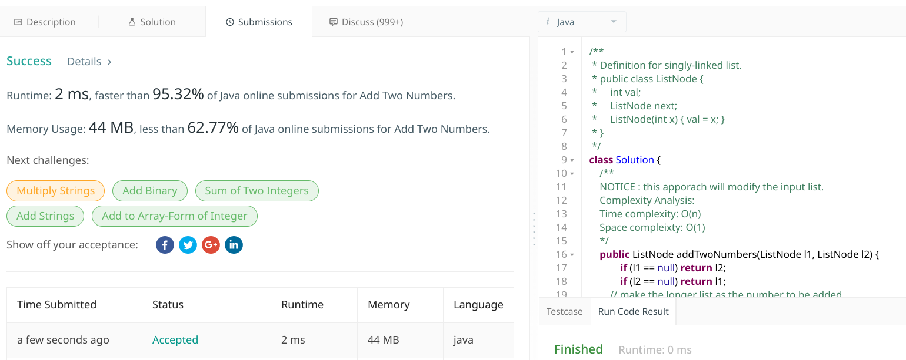

# 2. Add Two Numbers

## Description

You are given two non-empty linked lists representing two non-negative integers. The digits are stored in reverse order and each of their nodes contain a single digit. Add the two numbers and return it as a linked list.

You may assume the two numbers do not contain any leading zero, except the number 0 itself.

```txt
Example:

Input: (2 -> 4 -> 3) + (5 -> 6 -> 4)
Output: 7 -> 0 -> 8
Explanation: 342 + 465 = 807.
```
### Links

[(en)https://leetcode.com/problems/](https://leetcode.com/problems/add-two-numbers/)
<br />
[(中文)https://leetcode-cn.com/problems/](https://leetcode-cn.com/problems/add-two-numbers/)

## 解题思路

此题没什么特别需要注意的地方，主要考验是否熟悉链表，链表的遍历，结点的插入。


### Solution1

由于题目给出，需要相加的数字是翻转过后的，因此直接从遍历链表，结点两两相加并考虑进位，直到某一链表遍历完成。

> key point: 每次结点值相加时，判断当前结点值是否合法，不合法则从此结点开始遍历到链表尾部进行调整

乍一看，这种实现方式，每次发生进位都进行一次遍历到链表尾部的调整, 好像效率不高。

但是，考虑这样的情形: 当一个数比另一个数大很多时, 小的链表遍历完成算法也完成了
> 一个典型的例子: ``99999999999999999999999999999999999999999999999999``  和 ``1`` 相加
>
> 虽然可以提前终止相加的过程，但是，在代码开始前，需要获取链表的长度来确定哪个数比较大，O(n)
>
> (🤔 不过可以使用**快慢指针**来提高获取长度的效率，下面的代码没有给出，感兴趣的可以自己实现。)

**Complexity Analysis:**

- Time complexity : O(n)
- Space complexity: O(1)

#### Java Code 

我解题时的线上提交代码:

```java
/**
 * Definition for singly-linked list.
 * public class ListNode {
 *     int val;
 *     ListNode next;
 *     ListNode(int x) { val = x; }
 * }
 */
class Solution {
    /**
    NOTICE : this apporach will modify the input list.
    Complexity Analysis:
    Time complexity : O(n)
    Space compleixty: O(1)
    */
    public ListNode addTwoNumbers(ListNode l1, ListNode l2) {
            if (l1 == null) return l2;
            if (l2 == null) return l1;
        // make the longer list as the number to be added.
        int len1 = 0, len2 = 0;
        ListNode c;
        // calc the len of l1
        c = l1;
        while (c != null) {
            c = c.next;
            len1++;
        }
        // calc the len of l2
        c = l2;
        while (c != null) {
            c = c.next;
            len2++;
        }
        ListNode p, q; // p always point the larger number.
        if (len1 > len2) {
            p = l1;
            q = l2;
        } else {
            p = l2;
            q = l1;
        }
        while (p != null && q != null) {
             p.val += q.val;
            if (p.val > 9) {
               format(p);
            }
            p = p.next;
            q = q.next;
        }
        return len1 > len2 ? l1 : l2;
    }
    private void format(ListNode list) {
        ListNode p = list;
        while (p != null) {
            if (p.val > 9) {
                p.val %= 10;
                if (p.next == null) {
                    p.next = new ListNode(1);
                    break;
                }
                p.next.val++;
            }
            p = p.next;
        }
    }
}
```

#### submission status



> 如果你仔细看的话，上面的代码还以进一步优化，😹。
> **让调整的算法``format()``可以提前终止，没有需要处理的进位时，避免无意义的遍历操作。**

```java
...
private void format(ListNode list) {
    ListNode p = list;
    boolean flag = true;
    while (p != null) {
        flag = false;
        if (p.val > 9) {
            flag = true;
            p.val %= 10;
            if (p.next == null) {
                p.next = new ListNode(1);
                break;
            }
            p.next.val++;
        }
        if (!flag) break;
        p = p.next;
    }
}
```

### Solution2

考虑到第一种解法是在一个链表的基础上进行相加的，所以我们可以新建一个来链表来存放两个链表相加的结果(不对输入的链表进行修改)。

🤔不过似乎题目对于是否修改输入的链表也没有进行限定。

#### Java Code 

```java
class Solution {
    /**
     * since the approach one will modify the input list.
     *
     * this approach will make create a new list to store the results.
     *
     * Complexity Analysis:
     * Time complexity: O(n)
     * Space complexity: O(1)
     *
     * */
    public ListNode addTwoNubmer(ListNode l1, ListNode l2) {
        if (l1 == null) return l2;
        if (l2 == null) return l1;

        ListNode result = new ListNode(0);
        ListNode p = l1, q = l2, cur = result;
        
        int carry = 0;
        while (p != null || q != null) {
            int x = (p != null) ? p.val : 0;
            int y = (q != null) ? q.val : 0;
            int sum = carry + x + y;
            carry = sum / 10;
            cur.next = new ListNode(sum % 10);
            if (p != null) p = p.next;
            if (q != null) q = q.next;
        }
        if (carry > 0) {
            cur.next = new ListNode(carry);
        }
        return result.next;
    }
}
```

> 这种简易实现方式有一个致命的弱点，我在第一个解法中提到的情况，即当一个数非常的大而另外一个数且相对的小。<br />
> 此算法遍历的次数是取决于最长的链表的长度的。

### Solution 3

此解法综合上面提到的方法，对解法一中的调整算法进行优化，以及解法二中的遍历进行提前终止，然后直接将``result``的下一个结点指向剩余结点。进行最后一次调整即可。

> 此算法实现的效率估计和解法一的差不多，但是思路是不一样的。🌚还有，最后还是会修改输入的链表。

#### Java Code

```java
/**
 * Definition for singly-linked list.
 * public class ListNode {
 *     int val;
 *     ListNode next;
 *     ListNode(int x) { val = x; }
 * }
 */
class Solution {
    public ListNode addTwoNumbers(ListNode l1, ListNode l2) {
        ListNode result = new ListNode(0);
        ListNode p = l1, q = l2, current = result;
        
        int carry = 0;
        while (p != null && q != null) {
            int x = p.val;
            int y = q.val;
            int sum = carry + x + y;
            carry = sum / 10;
            current.next = new ListNode(sum % 10);
            current = current.next;
            p = p.next;
            q = q.next;
        }
        
       current.next = (p == null) ? q : p; // this operation will modify the input list.
        if (current.next == null)  {
            if (carry > 0) 
               current.next  = new ListNode(1);
            return result.next; // pointer overflow check.
        }
        if (carry > 0) {
            current.next.val++;
        }
        
        format(current.next);
        return result.next;
    }
    private void format(ListNode list) {
           ListNode p = list;
        boolean flag = true;
        while (p != null) {
            flag = false;
                if (p.val > 9) {
                    flag = true;
                    p.val %= 10;
                    if (p.next == null) {
                        p.next = new ListNode(1);
                        break;
                    }
                    p.next.val++;
                }
           if (!flag) break; 
            p = p.next;
        }
    }
}
```

#### submission status


### misc

至于提交代码中，最快的样本，🙄居然是第二种解法，只不过把三元运算符换成``if``来判断而已。
> 猜想: 🤔我似乎明白了什么，可能使用``if``来判断的代码编译后的质量更好吧！
