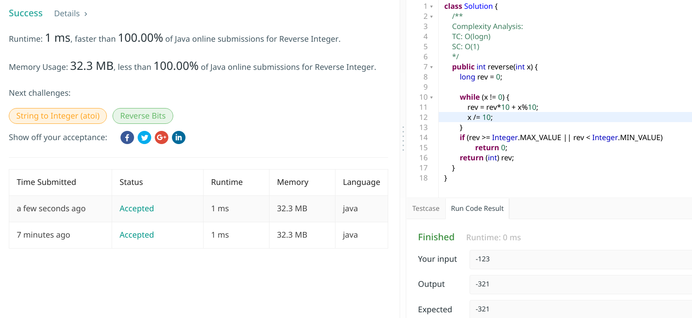

# 7. Reverse Integer

## Description

Given a 32-bit signed integer, reverse digits of an integer.

- Example 1:
```txt
Input: 123
Output: 321
```
- Example 2:
```
Input: -123
Output: -321
```
- Example 3:
```txt
Input: 120
Output: 21
```
 
### Note
Assume we are dealing with an environment which could only store integers within the 32-bit signed integer range: [$−2^31,  2^31 − 1$]. For the purpose of this problem, assume that your function returns 0 when the reversed integer overflows.

### Links

[(en)https://leetcode.com/problems/reverse-integer/](https://leetcode.com/problems/reverse-integer/)
<br />
[(中文)https://leetcode-cn.com/problems/reverse-integer/](https://leetcode-cn.com/problems/reverse-integer/)

## 解题思路

### Solution1

一道简单题，不多说，注意题目要求是要检测溢出的，[-2,147,483,648 ~ 2,147,483,647]范围才符合结果, 超出的返回0, 因此我优先考虑得到结果后再进行检测结果是否在这个范围内。**对于数字的反转**使用模运算即可。

**复杂度分析(Complexity Analysis)**:
1. Time compelxity: $O(log n)$, 因为循环执行$log_{10}(x)$次，所以$T(n) = O(log n)$
2. Space complexity: $O(1)$


#### Java Code 

我解题时的线上提交代码:

```java
class Solution {
    /**
     * Complexity Analysis:
     * TC: O(log(x)), since log_10(x) is O(log n)
     * SC: O(1)
     *
     * */
    public int reverse(int x) {
        // declare as long type to avoid overflow checking in the iterations
        long rev = 0; 

        while (x != 0) {
            rev = rev * 10 + x % 10;
            x /= 10;
        }
        // overflow checking
        if (rev >= Integer.MAX_VALUE || rev < Integer.MIN_VALUE)
            return 0;

        return (int) rev;
    }
}
```

#### Submission status



